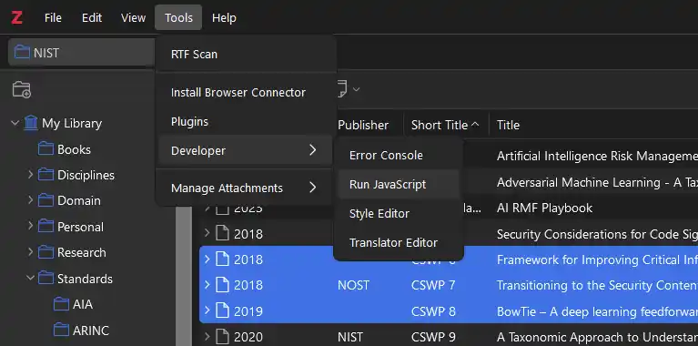
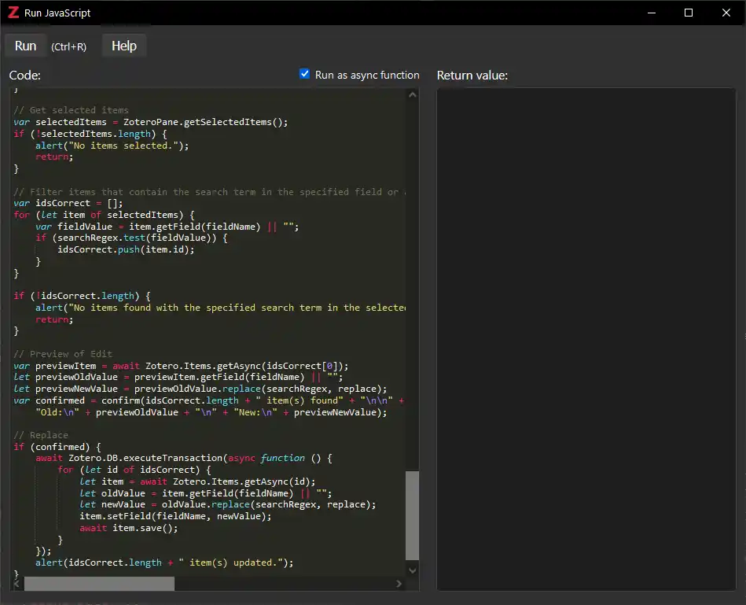
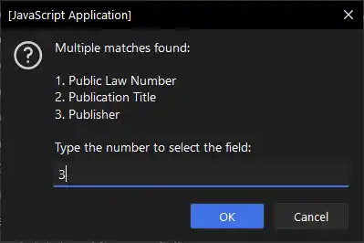
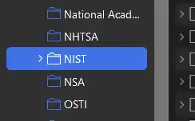
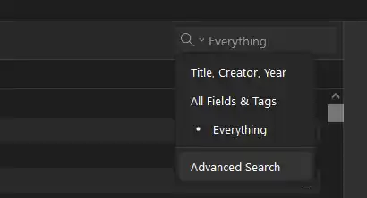
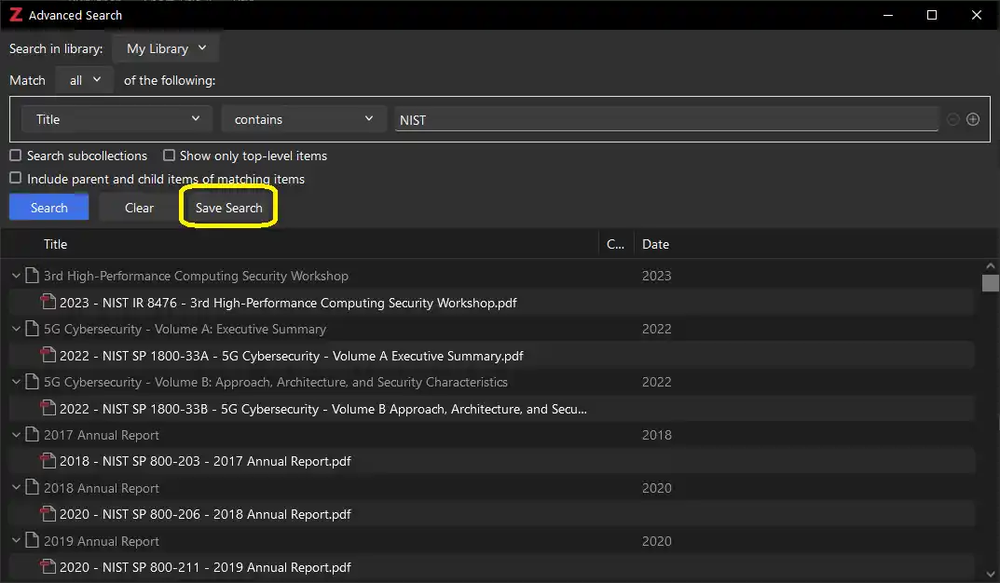
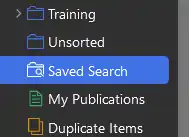
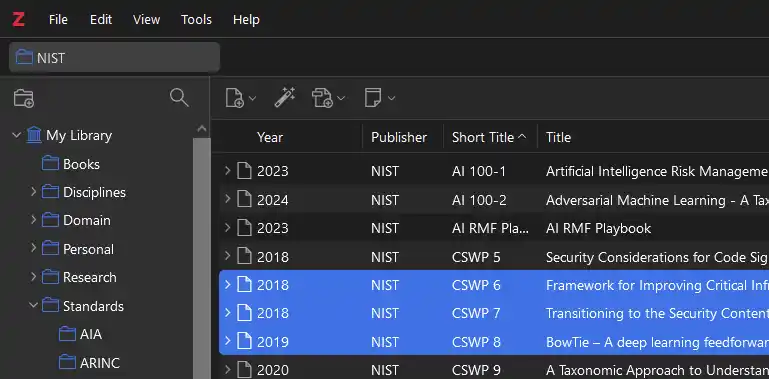

# Zotero Bulk Edit Script

## Overview

This script allows users to bulk edit records in Zotero by providing an easy-to-use prompt system to search and replace field values across multiple selected items. It supports a wide range of fields and ensures that the editing process is intuitive and user-friendly.

The script has been tested in Zotero v7.

This project builds on [Schoeneh's](https://github.com/Schoeneh) Zotero Search and Replace script.

## Features

- **Autocomplete Field Selection**: Start typing the name of the field you want to edit, and the script provides a list of matching fields for you to choose from. If multiple matches are found, the script prompts you to select the correct field.
- **Regular Expression Search**: Use full regular expressions to search for patterns within field values, allowing for advanced search capabilities. Wildcards (`*`) and special character escaping (`\`) are supported.
- **Case-Insensitive Matching**: The search functionality is case-insensitive, making it easier to find the records you want to edit.
- **Preview Changes**: Before applying changes, the script shows a preview of the old and new values for the first matching record, allowing you to confirm the bulk edit.
- **Bulk Processing**: Edits are applied to all selected items, items in the current collection, or items in a saved search that match the search criteria.

## Back Up

**Be sure to back up your local Zotero library**

- [Guide by University of Ottawa Library](https://uottawa.libguides.com/how_to_use_zotero/back_up_and_restore)
- [Official Documentation](https://www.zotero.org/support/zotero_data)

## Getting Started

1. **Select Items in Zotero**: Begin by selecting the items you want to edit in Zotero.
2. **Run the Script**: Execute the script to start the bulk editing process.
3. **Field Selection**: When prompted, start typing the field name you want to edit. The script will show matching options for you to confirm. If multiple matches are found, you will be prompted to select the correct field. For example, if you type "date," you might see options like "Date," "Date Decided," and "Date Enacted." Simply enter the number corresponding to your choice.
4. **Search and Replace**: Enter the search term using regular expressions for advanced search patterns, and specify the replacement value. Special characters can be escaped using `\`.
5. **Confirm Changes**: Review the preview of the changes for the first matching record and confirm to apply the edits.

## Example

In this example, we will update the `Publisher` field for a group of selected items:

1. Select the items in Zotero that you wish to edit.

   

2. Open the `Run Javascript` window in Zotero under `Tools > Developer > Run Javascript`.

   

3. This will open a second window in Zotero.

   

4. Copy and paste the [Bulk Edit script](https://github.com/thalient-ai/zotero-bulk-edit/blob/main/src/zotero_bulk_edit.js) into the `Run Javascript` window and select the `Run` button in the top left corner. This will start the JavaScript application. The script can be accessed [here](https://github.com/thalient-ai/zotero-bulk-edit/blob/main/src/zotero_bulk_edit.js) or by opening the .js file in your chosen text editor.

	

6. Enter the field that you wish to edit.

	

	  
Here is a list of all supported fields

	  
	  - Abstract
	  - Accessed Date
	  - Application Number
	  - Archive
	  - Archive ID
	  - Artwork Medium
	  - Artwork Size
	  - Assignee
	  - Audio File Type
	  - Audio Format
	  - Bill Number
	  - Blog Title
	  - Book Title
	  - Call Number
	  - Case Name
	  - Citation Key
	  - Code
	  - Code Number
	  - Code Pages
	  - Code Volume
	  - Committee
	  - Company
	  - Conference Name
	  - Country
	  - Court
	  - Date
	  - Date Decided
	  - Date Enacted
	  - Dictionary Title
	  - Distributor
	  - Docket Number
	  - Document Number
	  - DOI
	  - Edition
	  - Encyclopedia Title
	  - Episode Number
	  - Extra
	  - Filing Date
	  - First Name
	  - First Page
	  - Format
	  - Forum Title
	  - Genre
	  - History
	  - Identifier
	  - Institution
	  - Interview Medium
	  - ISBN
	  - ISSN
	  - Issue
	  - Issue Date
	  - Issuing Authority
	  - Journal Abbreviation
	  - Label
	  - Language
	  - Last Name
	  - Legal Status
	  - Legislative Body
	  - Library Catalog
	  - Location in Archive
	  - Map Type
	  - Manuscript Type
	  - Meeting Name
	  - Name of Act
	  - Network
	  - Note
	  - Number
	  - Number of Pages
	  - Number of Volumes
	  - Organization
	  - Pages
	  - Patent Number
	  - Place
	  - Post Type
	  - Presentation Type
	  - Priority Numbers
	  - Proceedings Title
	  - Program Title
	  - Programming Language
	  - Public Law Number
	  - Publication Title
	  - Publisher
	  - References
	  - Report Number
	  - Report Type
	  - Reporter
	  - Reporter Volume
	  - Repository
	  - Repository Location
	  - Rights
	  - Running Time
	  - Scale
	  - Section
	  - Series
	  - Series Number
	  - Series Text
	  - Series Title
	  - Session
	  - Short Title
	  - Status
	  - Studio
	  - Subject
	  - System
	  - Thesis Type
	  - Title
	  - Type
	  - University
	  - URL
	  - Version
	  - Video Recording Format
	  - Volume
	  - Website Title
	  - Website Type

	

	

8. Your input does not have to be case-sensitive or complete. The application will offer suggestions based on your input.

	
   
	

9. Enter the search term. The script supports regular expressions and can handle blank fields. Because the `Publisher` field of the selected items contains both blank and populated values, we will use the wildcard `*`.

	

	  
Click to expand for detailed explanations of special characters used in regular expressions

	  
	  - `.` : Matches any single character except newline.
	  - `*` : Matches 0 or more of the preceding element.
	  - `+` : Matches 1 or more of the preceding element.
	  - `?` : Matches 0 or 1 of the preceding element (makes it optional).
	  - `^` : Matches the start of the string.
	  - `$` : Matches the end of the string.
	  - `[]` : Matches any one of the enclosed characters.
	  - `[^]` : Matches any one character not enclosed.
	  - `\` : Escapes a special character.
	  - `|` : Acts as a logical OR between patterns.
	  - `()` : Groups patterns together and remembers the match.
	  - `{}` : Matches a specified number of occurrences of the preceding element.

	

	

10. Enter the replacement text.

	
   
11. Choose whether you want to edit selected items, all items in the active collection, or items in the active saved search.

	

	  
Click to expand for detailed explanations

	  
	- **Selected Items**: Edits are applied only to items you have explicitly selected in Zotero.
	
		
	
	- **Active Collection**: Edits are applied to all items within the currently selected collection in Zotero.
		
		- For search purposes, an "active" collection means that you have the collection selected in the Collections Pane in Zotero.
	
		
	
	- **Active Saved Search**: Edits are applied to all items that match the criteria of a saved search in Zotero.
	
		- To create a saved search click on the magnifying glass in the `Everything` search bar on the top right task bar and then select `Advanced Search`
	
		
		
		- Create your search and then click `Save Search`
	   
		
		
		- The `Saved Search` will appear in the Zotero Collections Pane above `My Publication`. For search purposes, an "active" saved search means that you have it selected in the Collections Pane in Zotero.
		  
		
	
	

	

12. The script will provide a summary of the changes for review before making them.

	
   
	

13. Here are the results.

	

## Error Handling

The script includes error handling to ensure a smooth user experience. If an error occurs during the update process, an alert will be displayed with the error message. Ensure that the items you want to edit are correctly selected, and follow the prompts carefully.

### Potential Error Messages and Solutions:

- **"No matches found. Please try again."**: This occurs if your field selection doesn't match any available fields. Try typing a different field name.
- **"Input canceled. Please start over."**: This indicates that the input was canceled. Restart the process and carefully follow the prompts.
- **"No items found with the specified search term."**: No items matched your search criteria. Verify your search term and try again.
- **"No items selected."**: Ensure you have selected the items you wish to edit before running the script.
- **"No collection selected."**: Make sure you have an active collection selected in Zotero if you choose to edit items in the active collection.
- **"No saved search selected."**: Ensure you have an active saved search selected in Zotero if you choose to edit items in a saved search.

## Other Considerations

Zotero handles item fields, creator names, and notes differently due to their distinct data structures and use cases:

### Item Fields:
- **General Metadata**: Fields like `title`, `abstractNote`, `publisher`, etc., are standard metadata fields applicable to various item types (e.g., books, articles).
- **Single Value**: Each field typically holds a single value.
- **Direct Editing**: Users can directly edit these fields without special handling.

### Creator Names:
- **Complex Structure**: Creator fields (`First Name`, `Last Name`) consist of multiple components (first name, last name, creator type).
- **Multiple Entries**: An item can have multiple creators (authors, editors, etc.).
- **Validation**: Both `firstName` and `lastName` fields need careful handling to avoid empty values, as Zotero enforces non-empty creator names. If you do remove the names, the script will prompt you with the option to delete the author/creator record. This will remove the author only and will not affect the item, attachment, or other metadata.

### Notes:
- **Rich Text Content**: Notes can contain rich text, allowing for annotations, links, and other formatted content.
- **Distinct Type**: Notes are treated as a special type of item in Zotero, separate from general metadata fields.
- **Multiple Notes**: An item can have multiple notes attached to it.
- **Direct Editing**: Notes can be edited directly, but their content structure requires handling of text formatting and potential links. The script can edit Notes that are selected (i.e., selected items); it cannot edit Notes using the active collection or saved search setting.

### Practical Implications:
- **Item Fields**: Simplified bulk edits with standard search and replace functionality.
- **Creator Names**: Requires transaction management, validation checks, and potential deletion if fields are empty post-editing to maintain data integrity.
- **Notes**: Bulk edits require handling rich text content, preserving formatting, and managing multiple notes per item. Bulk editing notes follows the same search and replace principles but needs to manage potential formatting issues.

### Summary:
- **Item Fields**: Bulk edits are straightforward and involve replacing text in single-value fields.
- **Creator Names**: Editing involves managing multiple components and ensuring data integrity through validation and transaction management.
- **Notes**: Bulk edits require handling rich text content, preserving formatting, and managing multiple notes per item.