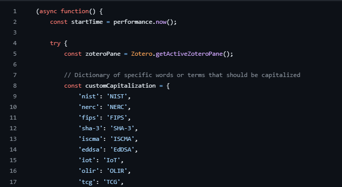
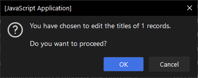

# Text Case Conversion Script

This script converts the case of titles and/or short titles for selected items to Title Case, Sentence Case, Upper Case, or Lower Case.

## Features

- **Scope Selection**: Prompts the user to select the scope of items to process (selected items, items in the current collection, or items in a saved search).
- **Case Conversion Options**: Allows the user to choose between Title Case, Sentence Case, Upper Case, or Lower Case.
- **Custom Capitalization Dictionary**: Handles specific terms and acronyms that should always be capitalized.
- **User Prompts**: Asks for user confirmation when encountering text within parentheses.
- **Detailed Logging**: Logs the time taken for each operation and provides detailed error handling and messages.

## Usage

1. **Download the Script**: Download `zotero-text-case.js` from the repository.
2. **Open Zotero**: Launch the Zotero application.
3. **Run JavaScript**:
    - Go to `Tools > Developer > Run JavaScript`.
    - Copy and paste the content of `zotero-text-case.js` into the Zotero JavaScript console.
    - Press `Run`.

### Example

To convert the case of titles in selected items:

0. If needed, edit the script with the terms, abbreviations, acronyms, or other text that should have customized capitalization.

1. Select the items in Zotero.
2. Run the script.

3. Choose the option to process selected items.

4. Select the desired case conversion (Title Case, Sentence Case, Upper Case, or Lower Case).

5. Select whether you wish to apply the changes to the Title field, Short Title field, or both.

There is logic in the script to treat any text within `( )` as a potential abbreviation or acronym. When this is detected, you'll be prompted if the entirety of that text should be upper case.

5. Confirm the operation.

**Title Case**

**Sentence Case**

**Upper Case**

**Lower Case**

## Detailed Script Description

The script performs the following steps:

1. **Initialization**: Logs the start time and sets up the Zotero pane.
2. **Scope Selection**: Prompts the user to select the scope of items to process.
    - Options: Selected items, items in the current collection, or items in a saved search.
3. **Retrieve Items**: Retrieves items based on the user’s selection.
4. **Case Conversion Option**: Prompts the user to select the desired case conversion (Title Case, Sentence Case, Upper Case, or Lower Case).
5. **Case Conversion Process**:
    - Converts the titles of the selected items to the chosen case.
    - Handles custom capitalization for specific terms and acronyms.
    - Prompts the user for confirmation when encountering text within parentheses.
6. **Completion**: Logs completion time and alerts the user that the conversion process is complete.

## Error Handling

- Provides detailed error messages and logs them to the console.
- Prompts the user if invalid options are selected.

## Functions Overview

- `getValidEditOption()`: Prompts the user to select the scope of items to process.
- `getItemsToEdit(editOption, zoteroPane)`: Retrieves items based on the user's selection.
- `getValidCaseOption()`: Prompts the user to select the desired case conversion.
- `toTitleCase(str, title, currentIndex, totalCount)`: Converts a string to Title Case based on specified rules.
- `toSentenceCase(str)`: Converts a string to Sentence Case.
- `toUpperCase(str)`: Converts a string to Upper Case.
- `toLowerCase(str)`: Converts a string to Lower Case.
- `capitalizeHyphenatedAndSlashed(word)`: Capitalizes both parts of a hyphenated or slashed word.
- `isFollowingSpecialChar(arr, index, separators)`: Checks if a word follows a special character.
- `escapeRegExp(string)`: Escapes special characters for regular expressions.
- `logTime(label, time)`: Logs the time taken for each operation.

## Compatibility
All scripts were written for Zotero 7

## Contributing

Contributions are welcome! Please feel free to submit a Pull Request or open an issue if you have any suggestions or find any bugs.

## License

This project is licensed under the GPL-3.0 License - see the [LICENSE](LICENSE) file for details.
